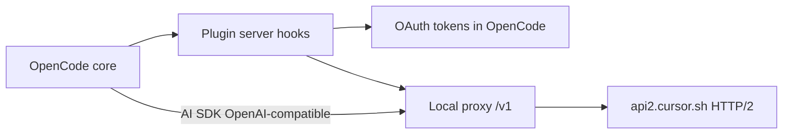
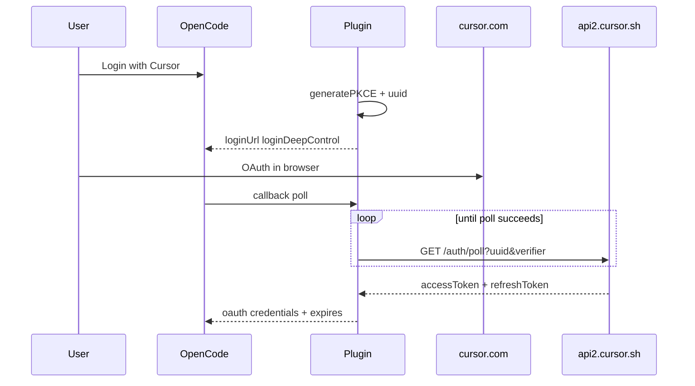
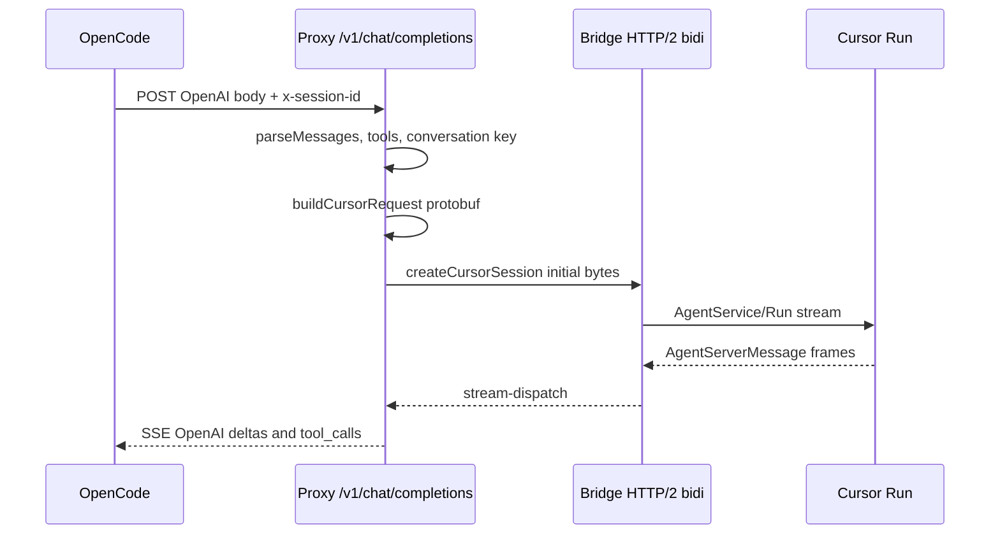

# How the OpenCode Cursor Plugin Works

## Overview

OpenCode treats **Cursor** as a standard model provider. This plugin does not call a public OpenAI API. Instead it:

1. Authenticates with **OAuth + PKCE** against Cursor.
2. Discovers models via **gRPC Connect** (unary) over **HTTP/2**.
3. Starts a **local HTTP proxy** on a random `127.0.0.1` port that speaks **OpenAI Chat Completions**.
4. Translates each request into **protobuf** for `AgentService/Run` (bidirectional streaming) and returns **OpenAI-style SSE** to OpenCode.

The single plugin entry point is `src/plugin/cursor-auth-plugin.ts` (also exported from `src/index.ts` and `src/server.ts`).

<!-- 📊 Diagram Placeholder
Type: Architecture
Purpose: Show end-to-end component relationships
Scope: OpenCode Cursor plugin
Description: OpenCode core, plugin hooks, OAuth token store, local OpenAI proxy, and api2.cursor.sh HTTP/2 bidi/unary paths.
Tool Suggestion: Mermaid
Status: done
Last Updated: 2026-06-08
-->

*Caption:* High-level topology from OpenCode through the local proxy to Cursor cloud APIs.

---

## OpenCode integration

The plugin registers a **server** plugin (`oc-plugin: ["server"]`) and returns hooks from `server()` in `cursor-auth-plugin.ts`.

| Hook | Role |
|------|------|
| `config` | Ensures `provider.cursor` exists with display name "Cursor". |
| `provider.id` + `provider.models` | Returns models already injected on the provider object. |
| `auth.loader` | Refreshes tokens, runs model discovery, starts proxy, sets `baseURL` and per-model API URLs. |
| `auth.methods` (OAuth) | Browser login URL + polling callback for tokens. |
| `chat.headers` | Adds `x-session-id` and optional `x-opencode-agent` for the proxy. |

Provider id constant: `CURSOR_PROVIDER_ID` = `"cursor"` in `src/constants.ts`.

After a successful loader run, OpenCode talks to `http://localhost:{port}/v1` with `apiKey: "cursor-proxy"` (placeholder; real Cursor tokens stay inside the plugin proxy path).

---

## OAuth flow

Authentication is implemented in `src/auth.ts` with PKCE in `src/pkce.ts`.

| Step | Detail |
|------|--------|
| Start | `generateCursorAuthParams()` builds PKCE challenge, `uuid`, and `https://cursor.com/loginDeepControl?...&mode=login&redirectTarget=cli`. |
| Poll | `GET https://api2.cursor.sh/auth/poll?uuid=&verifier=`; `404` means keep waiting with backoff (1s → 10s, max 150 attempts). Uses `Bun.sleep`. |
| Refresh | `POST` to `CURSOR_REFRESH_URL` (default `https://api2.cursor.sh/auth/exchange_user_api_key`) with `Authorization: Bearer {refresh}`. |
| Expiry | `getTokenExpiry()` decodes JWT `exp` and subtracts 5 minutes; fallback 1 hour from now. |

OpenCode persists credentials via `input.client.auth.set`. The plugin reads and refreshes them in `auth.loader` and in the proxy’s `getAccessToken` callback.

---

## Provider startup (`auth.loader`)

Order of operations in `cursor-auth-plugin.ts`:

1. `getAuth()` — if missing or not `type: "oauth"`, return `{}`.
2. If `access` is missing or `expires < Date.now()`, call `refreshCursorToken` and `auth.set`.
3. `getCursorModels(accessToken)` — unary RPC `GetUsableModels` (`src/models.ts`, `src/proto/agent_pb.ts`).
4. `startProxy(getAccessToken, models)` — Node `http` server on ephemeral port `127.0.0.1`.
5. `setProviderModels(provider, buildCursorProviderModels(models, port))` — each model’s API URL is `http://localhost:{port}/v1` with npm `@ai-sdk/openai-compatible`.
6. Return `{ baseURL: http://localhost:{port}/v1, apiKey: "cursor-proxy" }`.

On failure: `stopProxy()`, clear models, optional TUI toast (`showDiscoveryFailureToast`), return `buildDisabledProviderConfig(message)` so requests fail with a clear error instead of hanging.

---

## Chat flow

### Local proxy HTTP (`src/proxy/server.ts`)

- `GET /v1/models` — cached list from discovery.
- `POST /v1/chat/completions` — parses body, resolves access token, passes `ChatRequestContext` from headers (`sessionId`, `agentKey`).

### Request orchestration (`src/proxy/chat-completion.ts`)

1. **`parseMessages`** (`src/openai/messages.ts`) — system prompt, user text, turns, tool results, pending assistant summary.
2. **Session title** — if the request matches `OPENCODE_TITLE_REQUEST_MARKER`, handled separately in `src/proxy/title.ts`.
3. **Tools** — `src/openai/tools.ts` maps OpenCode tools to MCP-style definitions for protobuf (`buildMcpToolDefinitions`, `selectToolsForChoice`).
4. **Conversation state** (`src/proxy/conversation-state.ts`) — key from `sessionId + agent` or message hash:
   - `conversationId`, Cursor **checkpoint** bytes, `blobStore`.
   - TTL 30 minutes; active tool bridges in `activeBridges`.
5. **`buildCursorRequest`** (`src/proxy/cursor-request.ts`) — builds `AgentRunRequest` from history or resumed checkpoint; may append cloud agent rules (`src/agent-rules.ts`).

### Cursor transport (`src/cursor/`)

| Mechanism | File | Use |
|-----------|------|-----|
| Unary RPC | `unary-rpc.ts` | Model discovery and other single-shot calls over HTTP/2. |
| Bidi session | `bidi-session.ts` | Connect stream to `/agent.v1.AgentService/Run`. |
| Framing | `connect-framing.ts` | Connect protocol message framing. |
| Headers | `headers.ts`, `config.ts` | Client version and auth headers (`CURSOR_API_URL`, `CURSOR_CLIENT_VERSION`). |

Bridge startup (`src/proxy/bridge-session.ts`) opens the session and sends **heartbeats** every 5 seconds.

### Streaming back to OpenCode (`src/proxy/bridge-streaming.ts`, `stream-dispatch.ts`)

- Parses Connect frames into `AgentServerMessage`.
- Emits **SSE** in OpenAI chat completion shape (content deltas, `tool_calls`, usage).
- **Tool calls**: bridge stays open; the next request with tool results uses `handleToolResultResume` and `activeBridges` keyed by `deriveBridgeKey`.
- Checkpoints and blob store sync via `state-sync.ts` so multi-turn chat can resume Cursor-side state.

---

## Code map

| Area | Path | Responsibility |
|------|------|----------------|
| Plugin | `src/plugin/cursor-auth-plugin.ts` | OpenCode hooks, auth/proxy wiring. |
| Auth | `src/auth.ts`, `src/pkce.ts` | OAuth outside chat. |
| Models | `src/models.ts` | Discovery + Zod normalization. |
| Provider metadata | `src/provider/models.ts`, `model-cost.ts` | Capabilities, limits, cost estimates for OpenCode UI. |
| Proxy | `src/proxy/*` | HTTP server, bridge, SSE, conversation state. |
| OpenAI shim | `src/openai/*` | Message and tool shapes OpenCode expects. |
| Cursor client | `src/cursor/*` | HTTP/2, Connect, Run session. |
| Protobuf | `src/proto/agent_pb.ts` | Generated agent service messages. |
| Logging | `src/logger.ts` | Structured plugin logs. |

---

## Local development

| Task | Command / note |
|------|----------------|
| Build | `npm run build` — runs `tsc` and copies `AGENTS.md` into `dist/` (`scripts/build.mjs`). |
| Package entry | `dist/index.js`, `dist/server.js` per `package.json` exports. |
| Runtime | Auth polling uses **Bun** (`Bun.sleep` in `auth.ts`); OpenCode runs the plugin in its embedded runtime when installed. |
| Environment | `CURSOR_API_URL`, `CURSOR_REFRESH_URL` override API endpoints. |
| Debugging | Enable plugin logs; trace `handleChatCompletion`, `bridge-streaming.ts`, and `auth.loader` failures. |

---

## Known limitations

- One proxy instance per plugin process; port is fixed until `stopProxy()` or process exit.
- Bridges and conversation checkpoints live **in memory**; restarting OpenCode drops local resume state.
- Cursor’s agent API is **undocumented** and may change; client version and protobuf paths in `src/cursor/config.ts` can break on upstream updates.
- The OpenCode-facing `apiKey` is not the Cursor JWT; tokens are injected only when the proxy calls Cursor.

---

## Where to change what

| Goal | Start here |
|------|------------|
| Login, poll, or refresh behavior | `src/auth.ts` |
| Model list or capabilities | `src/models.ts`, `src/provider/models.ts` |
| OpenCode message or tool mapping | `src/openai/messages.ts`, `src/openai/tools.ts` |
| Cursor protocol or streaming | `src/cursor/bidi-session.ts`, `src/proxy/stream-dispatch.ts` |
| Multi-turn state and tool resume | `src/proxy/conversation-state.ts`, `src/proxy/state-sync.ts`, `src/proxy/cursor-request.ts` |
| Agent rules sent to Cursor cloud | `src/agent-rules.ts` |

---

## Diagram index

| Type | Purpose | Status |
|------|---------|--------|
| Architecture (Mermaid flowchart) | OpenCode ↔ plugin ↔ proxy ↔ Cursor | done |
| Sequence (OAuth) | PKCE and token poll | done |
| Sequence (chat) | Chat completion through bidi Run | done |
| Architecture placeholder | Component topology reference | done |
